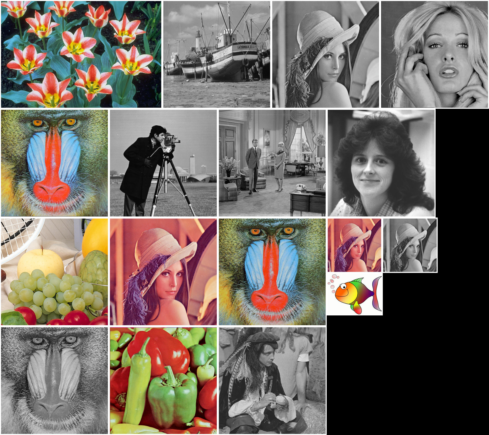

**still in progress**

### Open Issues:
- [ ] Support of tiff and other images that are not implemented natively in rust.
- [ ] Possibility to expand the collage to the left and top and not only to the right and bottom.

---

# ImageGridOptimizer

ImageGridOptimizer is a command-line utility that streamlines the process of compiling multiple images from a specified directory into a cohesive collage. This tool not only arranges images to minimize the collage's overall dimensions but also offers functionality to filter images by extension or filename criteria. Each image in the collage is framed with a white border, enhancing visual separation and overall aesthetic appeal.



## Key Features

- **Dynamic Image Placement**: Implements an algorithm to place images efficiently within a collage, aiming to reduce the final image's dimensions.
- **Flexible Image Filtering**: Supports filtering of images based on their extensions or specific filename components, allowing for greater control over the images included in the collage.
- **White Border Enhancement**: Automatically adds a white border around each image, ensuring distinct separation and a visually pleasing result.

## Getting Started

### Prerequisites

Ensure you have both Rust and Cargo installed on your system. These tools are essential for building and running the ImageGridOptimizer.

### Installation

1. Ensure you have Rust and Cargo installed on your machine.
2. Clone this repository:
   ```bash
   git clone https://github.com/ludgerradke/ImageGridOptimizer.git
   ```
3. Navigate to the project directory and build the project:
   ```bash
   cd ImageGridOptimizer
   cargo build --release
   ```

### How to Use

To use ImageGridOptimizer, navigate to the `target/release` directory within the project folder. Execute the program by running:

```bash
./ImageGridOptimizer [DIRECTORY] -f [FILTER] -w [WIDTH] -n [NUM_TRIALS] --min-images [MIN_IMAGES] --max-images [MAX_IMAGES]
```

- `DIRECTORY`: Specifies the directory containing the images for the collage.
- `FILTER` (Optional): Filters the images by extension (e.g., `.jpg`, `.png`) or a part of the filename (e.g., `*img_1*`).
- `WIDTH` (Optional): Sets an optional standard width to which all images will be scaled.
- `NUM_TRIALS` (Optional): Determines the number of trials to generate collages, allowing the algorithm to explore different arrangements.
- `MIN_IMAGES` (Optional): Sets the minimum number of images per collage.
- `MAX_IMAGES` (Optional): Defines the maximum number of images per collage.

The final collage will be saved as `output.jpg` in the project's root directory.

### Example

To create a collage from images in the `my_photos` directory, filtering for `.jpg` files, scaling images to a width of 800 pixels, with at least 20 images and no more than 70, performing 1000 trials:

```bash
./ImageGridOptimizer my_photos -f .jpg -w 800 -n 1000 --min 20 --max 70
```

## Contributing

Contributions are welcome! Please fork the repository and create a pull request with your changes.

## License

This project is licensed under the MIT License - see the [LICENSE](LICENSE) file for details.