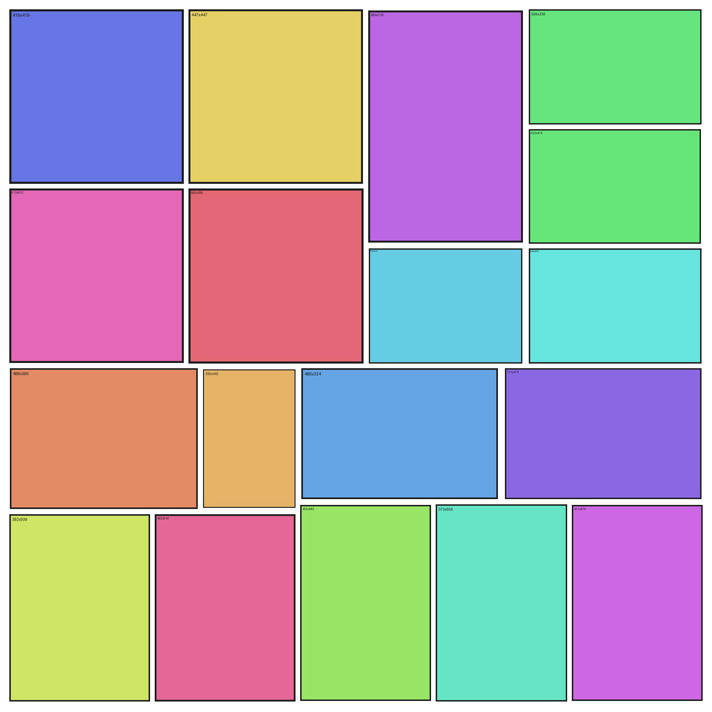
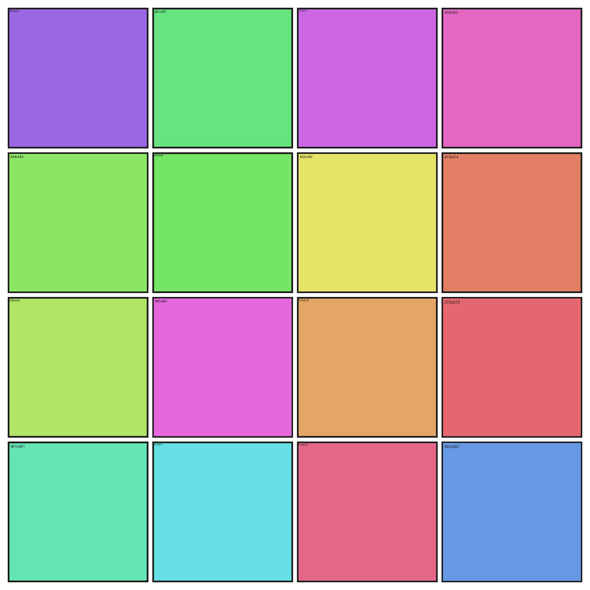
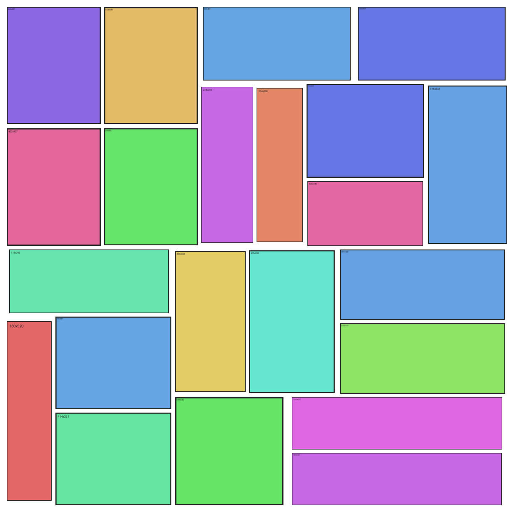
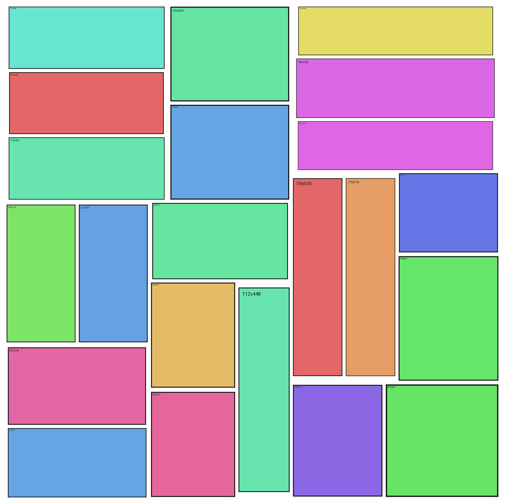
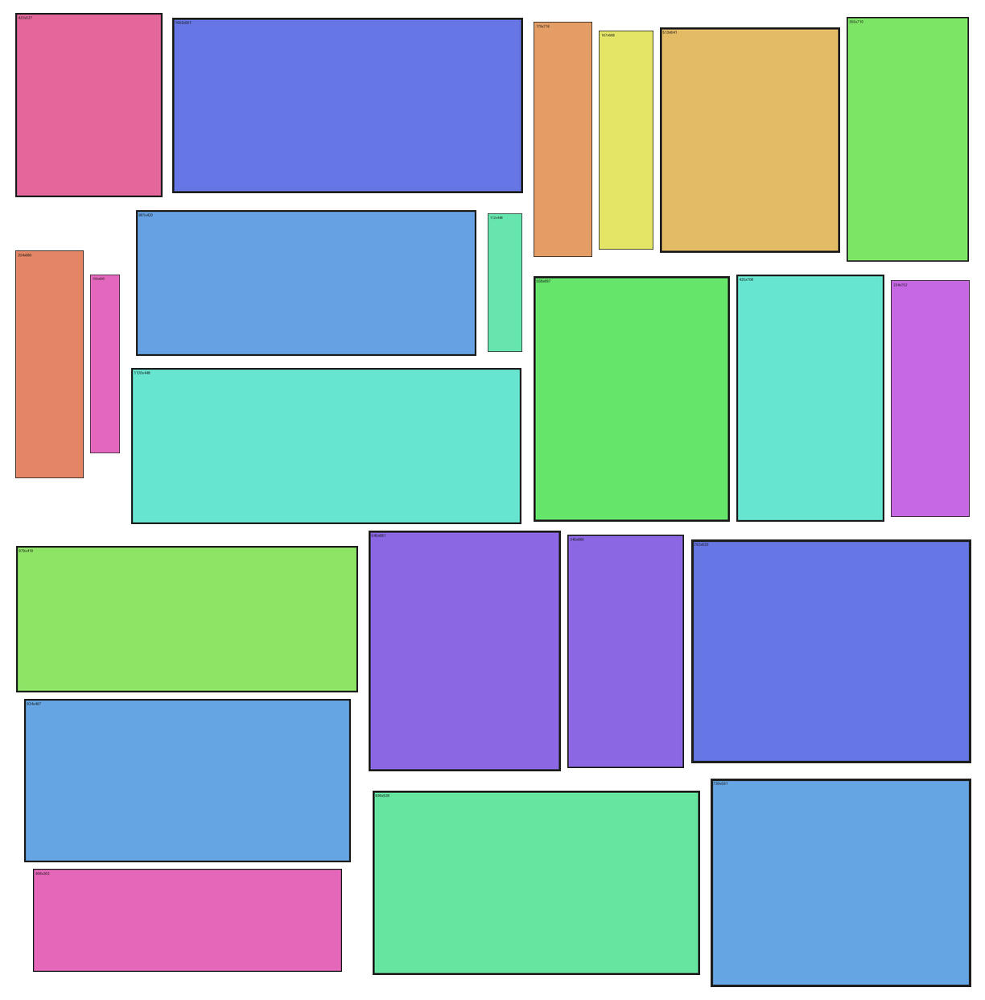
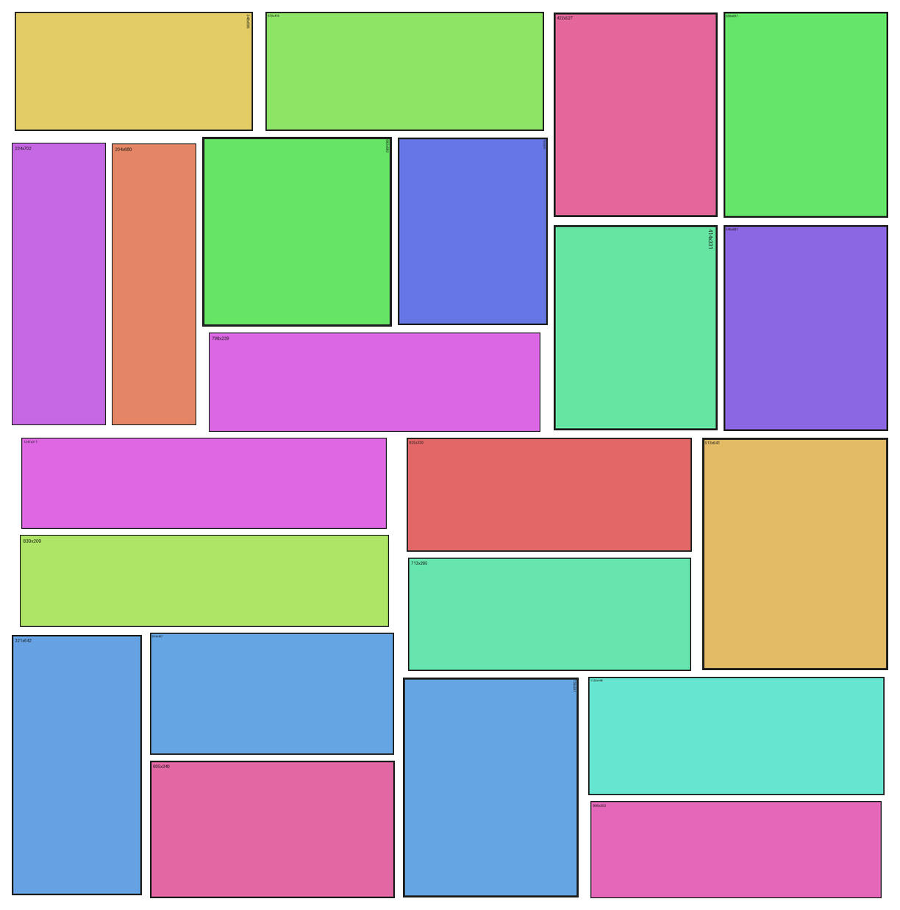

# ImageGridOptimizer

ImageGridOptimizer arranges a directory of images into a single, **gap-free** collage. A genetic algorithm evolves a **slicing tree** — a recursive horizontal/vertical partition of the canvas — so every image keeps its own aspect ratio while the cells tessellate the canvas with no holes by construction. It picks the best subset of the available images and runs in parallel via Rayon.



## Key Features

- **Gap-free slicing-tree layout** — the canvas is recursively split so image cells tessellate exactly; no interstitial white holes, no rigid grid forced onto varied photos.
- **Aspect ratios preserved** — images are never stretched or cropped; mixed landscape/portrait/square photos interlock into a clean mosaic.
- **`--flex` slider (0..1)** — `1` fills every cell (dense, gap-free); `0` keeps each image at its native relative size with whitespace around it; values in between blend continuously.
- **Subset selection** — feed in more images than you need; the GA chooses which subset (between `--min-images` and `--max-images`) packs best. Each image is used at most once.
- **Controllable aspect ratio** — `--aspect` steers the overall width/height of the collage.
- **Optional 90° rotation** — `--rotate` lets the GA flip images to pack extreme aspect ratios more tightly.
- **Filtering & parallelism** — filter by extension or filename substring; fitness evaluation runs across all CPU cores.

## How It Works

Each leaf of the slicing tree is one image; each internal node is a horizontal or vertical cut. Aspect ratios combine bottom-up, which is what guarantees a perfect tessellation:

- **side by side** (equal height): `a = a_left + a_right`
- **stacked** (equal width): `1/a = 1/a_top + 1/a_bottom`

The root's aspect ratio determines the canvas shape; pixel boxes are then assigned top-down with integer split points (no seams). The genetic algorithm evolves the tree — flipping cuts, swapping images, adding/removing images, toggling rotation — and scores each candidate with

```
fitness = image_count / (1 + |ln(aspect / target_aspect)| * 2 + size_imbalance * 3)
```

so it favours collages that use many images, match the target aspect ratio, and keep image sizes balanced. Because the layout is gap-free by construction, "minimise whitespace" is no longer part of the objective — `--flex` handles whitespace at render time instead.

## Getting Started

**Prerequisites:** [Rust and Cargo](https://rustup.rs/) (dependencies are managed by Cargo).

```bash
git clone https://github.com/ludgerradke/ImageGridOptimizer.git
cd ImageGridOptimizer
cargo build --release
```

## Usage

```bash
./target/release/ImageGridOptimizer <DIRECTORY> [OPTIONS]
```

| Option | Description | Default |
|--------|-------------|---------|
| `-f, --filter <F>` | Keep only images whose name contains `F` (extension or substring). | – |
| `--flex <0..1>` | `1` = gap-free fill, `0` = native sizes with whitespace. | `1.0` |
| `--aspect <A>` | Target width/height of the whole collage. | `1.0` |
| `--rotate` | Allow 90° rotation for tighter packing. | off |
| `--min-images <N>` / `--max-images <N>` | Subset-size window. | `6` / `60` |
| `--width <px>` | Content width of the rendered collage. | `1600` |
| `--gutter <px>` | White spacing between images. | `8` |
| `--margin <px>` | White border around the collage. | `12` |
| `--pop-size <N>` | GA population size. | `500` |
| `--gens <N>` | GA generations. | `600` |
| `--mutation-rate <R>` | Probability of extra mutations per offspring. | `0.3` |
| `-w, --std-width <px>` | Downscale every source image to this width before packing. | – |

The result is written to `output.jpg` in the current directory.

```bash
./target/release/ImageGridOptimizer my_photos -f .jpg --aspect 1.5 --min-images 20 --max-images 70 --rotate
```

## Test Images

The packer is best stressed by **aspect-ratio variety**, so a generator produces graded test sets:

```bash
uv run generate_test_images.py        # writes _test_dir/{easy,medium,hard}
```

| Difficulty | Aspect ratios | Result |
|------------|---------------|--------|
| **easy** | one (squares) | tiles into a clean grid |
| **medium** | five | light interlocking mosaic |
| **hard** | two dozen, incl. wide panoramas and narrow tall strips | complex interlocking |

## Examples

**Difficulty grades** (`--flex 1.0`):

| easy | medium | hard |
|:----:|:------:|:----:|
|  |  |  |

**The `--flex` slider** — same images, gap-free fill vs. native sizes:

| `--flex 1.0` | `--flex 0.0` |
|:------------:|:------------:|
|  |  |

**`--rotate`** lets the GA flip extreme formats to pack the *hard* set more tightly:



## Contributing

Contributions are welcome — fork, branch, and open a pull request.

## Releasing a Version

```bash
git tag v3.0
git push origin v3.0
```

## License

MIT — see [LICENSE](LICENSE).
